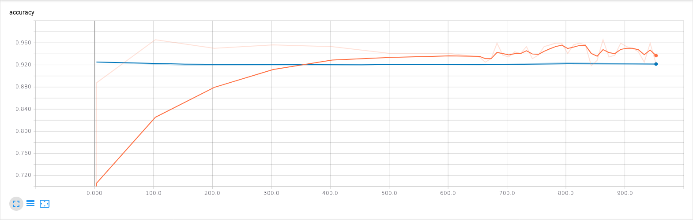

# Results of Classification on Pascal VOC2012
All models were trained on Pascal VOC2012 (subset of training data + validation data) for 20 epochs with Adam optimizer using 1e-4 learning rate. 

## Classification Accuracy
| Filename                               | Layers | Plasticity | Accuracy |
| -------------------------------------- | ------ | ---------- | -------- |
| [DarknetScreen.png](DarknetScreen.png) | 20     | No         | 90.19    |

## Training Curves
The training curves have been obtained through Tensorboard after smoothing with a linear filter (default in Tensorboard) with the default value of 0.6. 
The orange curves represent training accuracy/loss. 
The blue curves represent validation accuracy/loss.

### Standard Darknet
Accuracy

Loss

