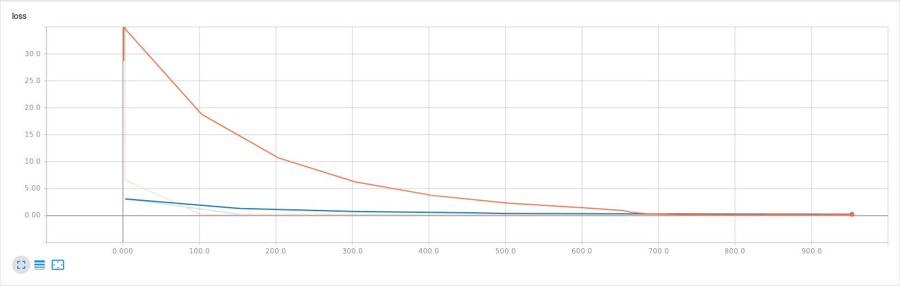
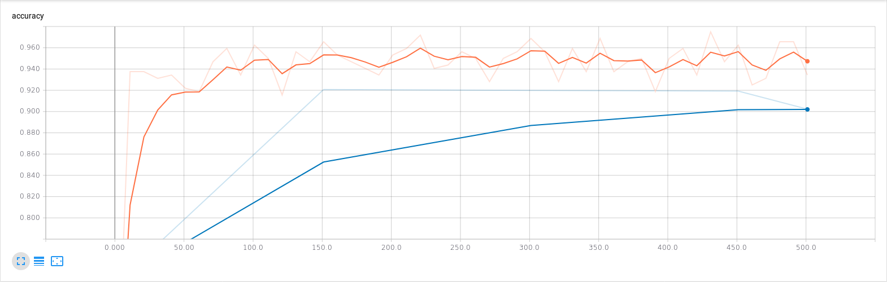

# Results of Classification on Pascal VOC2012
Models are based on the Darknet53 model in the paper: [YOLOv3: An Incremental Improvement](https://pjreddie.com/media/files/papers/YOLOv3.pdf)
All models were trained on Pascal VOC2012 for 20 epochs with Adam optimizer using 1e-4 learning rate. 
Plasticity on the upper layers indicates that plasticity was applied on the top 43 convolution layers. 
Plasticity on the lower layers indicates that plasticity was applied on the bottom 10 layers, ie. the lower 9 convolution layers and the fully connected layer. 

## Classification Accuracy
When validation data is used, 30% of the training dataset is randomly selected for validation, with early stopping based on the validation loss. 
When validation data is not used, the model is trained on the entire training dataset without early stopping.
| Filename                                                           | Validation | Plasticity   | Accuracy |
| --------------------------------------------------------------     | ---------- | ------------ | -------- |
| [DarknetScreen.png](DarknetScreen.png)                             | Yes        | No           | 90.19    |
| [DarknetScreen-2.png](DarknetScreen-2.png)                         | No         | No           | 90.65    |
| [FullyPlasticDarknetScreen.png](FullyPlasticDarknetScreen.png)     | Yes        | All layers   | 90.18    |
| [FullyPlasticDarknetScreen-2.png](FullyPlasticDarknetScreen-2.png) | No         | All layers   | 90.29    |
| [UpperPlasticDarknetScreen.png](UpperPlasticDarknetScreen.png)     | Yes        | Upper layers | 90.51    |
| [UpperPlasticDarknetScreen-2.png](UpperPlasticDarknetScreen-2.png) | No         | Upper layers | 90.59    |
| [LowerPlasticDarknetScreen.png](LowerPlasticDarknetScreen.png)     | Yes        | Lower layers | 90.23    |
| [LowerPlasticDarknetScreen-2.png](LowerPlasticDarknetScreen-2.png) | No         | Lower layers | 90.24    |

## Training Curves
The training curves have been obtained through Tensorboard after smoothing with a linear filter (default in Tensorboard) with the default value of 0.6. 
The orange curves represent training accuracy/loss. 
The blue curves represent validation accuracy/loss.

### Standard Darknet53
Accuracy

Loss

### Fully Plastic Darknet53
Accuracy

Loss

### Darknet53 with Plasticity on Upper Layers
Accuracy

Loss

### Darknet53 with Plasticity on Lower Layers
Accuracy

Loss

