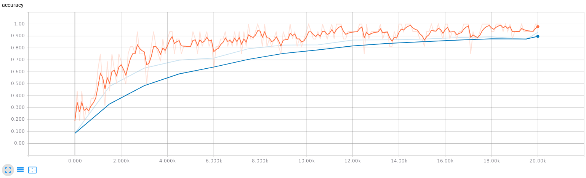
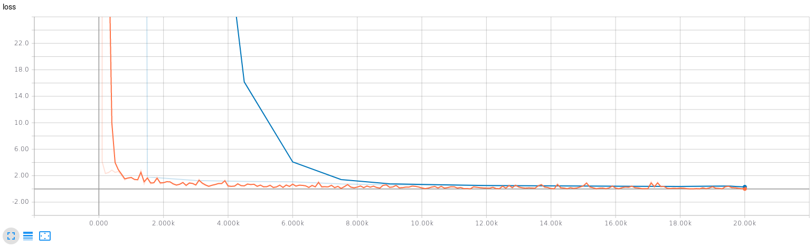

# Results of Classification on SVHN
All models were trained on SVHN (training data + extra data) for 20 epochs with Adam optimizer using 1e-4 learning rate. 
Partial plasticity implies plasticity used only on fully-connected layers, while full plasticity implies plasticity on CNNs too.

## Classification Accuracy
| Filename                                                             | Layers | Plasticity | Accuracy |
| -------------------------------------------------------------------- | ------ | ---------- | -------- |
| [Resnet20Screen.png](Resnet20Screen.png)                             | 20     | No         | 96.54    |
| [PartialPlasticResnet20Screen.png](PartialPlasticResnet20Screen.png) | 20     | Partial    | 96.58    |
| [PlasticResnet20Screen.png](PlasticResnet20Screen.png)               | 20     | Yes        | 96.71    |
| [Resnet56Screen.png](Resnet56Screen.png)                             | 56     | No         | 96.92    |
| [PartialPlasticResnet56Screen.png](PartialPlasticResnet56Screen.png) | 56     | Partial    | 96.57    |
| [PlasticResnet56Screen.png](PlasticResnet56Screen.png)               | 56     | Yes        | 96.94    |

## Training Curves

### Standard Resnet
#### 56 Layers
Accuracy

Loss

#### 20 Layers
Accuracy

Loss

### Resnet with Partial Plasticity
#### 56 Layers
Accuracy

Loss

#### 20 Layers
Accuracy

Loss

### Resnet with Full Plasticity
#### 56 Layers
Accuracy

Loss

#### 20 Layers
Accuracy

Loss

